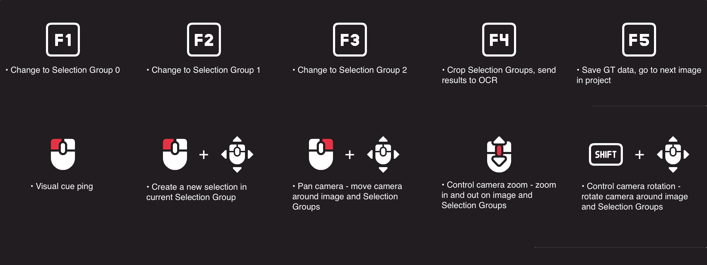
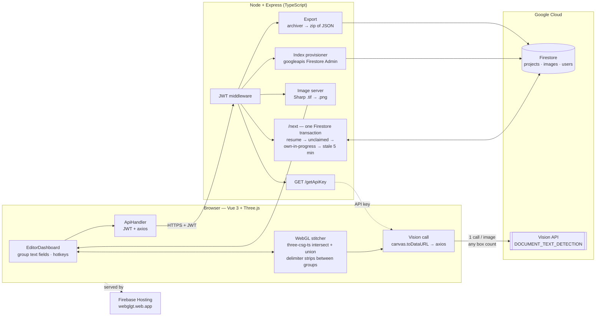

# WebGLGT

*Multi-user OCR ground-truth annotation on a WebGL canvas — draw any number of regions and they collapse into a single Google Vision call per image.*


WebGLGT is a full-stack annotation tool that lets multiple human annotators label OCR training data from a shared work queue, drawing free-form selection regions directly on a Three.js canvas. I built it to replace a slow, single-user Windows desktop tool: this one runs in a browser, has no dependency on internal SSO/AD/VPN, and is self-contained enough to be used on anything from mail pieces to forms to arbitrary scanned text.

[Live Demo](https://webglgt.web.app) · [How it works](#architecture)

---

## Visual proof


<!-- TODO: replace with a real demo.gif (≤1200px wide; Kap on Mac / ScreenToGif on Windows / LICEcap cross-platform). Capture the full keyboard-driven loop: draw boxes across selection groups → F4 "send to OCR" → text lands in the group fields → F5 save & next. -->

<!-- TODO: add an admin-panel screenshot — create project + project stats + "Export to JSON". -->
<!--  -->

## Why this exists

The original ground-truth tool was a Windows desktop app: one annotator at a time, tied to Active Directory and a company VPN, and slow enough that throughput on a 5k-image batch was a real bottleneck. WebGLGT removes those constraints. There's no AD, no VPN, no SSO dependency — anyone with a URL and credentials can annotate, which makes it usable by temp staff and outside contractors. It also keeps the keyboard-driven workflow the existing annotators relied on, so adopting it didn't mean retraining anyone.

## Features

- **WebGL annotation canvas** — draw any number of bounding boxes per image across up to three color-coded selection groups. Overlapping boxes inside a group are merged with a CSG union into one clean region, so the OCR sees a single shape rather than a pile of overlapping rectangles.
- **One Google Vision call per image, no matter the box count** — the drawn regions are cropped and stitched into a single image on the GPU (a delimiter strip between each group), captured straight off the WebGL canvas, and sent to Vision as one `DOCUMENT_TEXT_DETECTION` request. The OCR text comes back as one string and is split per group. Draw 1 box or 30 across 3 groups — it's still one call.
- **Multi-user image queue with transactional claims** — a single Firestore transaction either resumes your in-progress image or hands you the next one, falling through *unclaimed → your own in-progress → another user's claim gone stale after 5 minutes*, with a per-user recent-history list so you don't get the same image twice in a row. No locks, no polling, no two annotators stepping on each other.
- **Session continuity** — JWT auto-login (from `localStorage`) restores the last project and resumes the exact in-progress image after a refresh or a full browser restart.
- **Keyboard-driven editing** — selection-group switching, per-group text fields, save/next/prev, image pan/zoom, and rotation (with a grid overlay for alignment) are all reachable from the keyboard and mouse, so a fast annotator never leaves the home row. A searchable file browser jumps straight to any image by filename.
- **Per-project setup** — the number of selection groups and the classification tags are configured per project (USPS: RTS / Form 3547 / FWD / DBL Feed; TJX: Vendor Only), and the editor renders the right group count and tag buttons for whichever project you opened.
- **Admin panel** — create a new project (which also provisions the Firestore composite indexes the queue's queries depend on) and export all completed annotations as a zip of per-image JSON.
- **Self-resetting demo mode** — when the `demo` user logs in, the server wipes the demo project's annotation state, so every portfolio visitor lands on a clean slate.


<!-- Real in-repo asset (Client/devAssets/keyBindings.png). Consider moving it to ./assets/ so the README's image paths are co-located. -->

## Tech stack

**Frontend**
- Vue 3 (components authored in TSX via `@vitejs/plugin-vue-jsx`), TypeScript, Vite
- Three.js with `three-csg-ts` — CSG `intersect` crops each region against the image, `union` merges boxes and groups into one mesh
- Tailwind CSS (+ `@tailwindcss/forms`), Heroicons
- `mitt` (event bus), Axios — including the direct REST call to Google Vision
- Firebase Web SDK (auth + analytics)
- `dat.GUI` and `stats.js` for the debug overlay

**Backend**
- Node.js, Express, TypeScript
- `firebase-admin` (Firestore as the primary data store)
- `jsonwebtoken` — JWT auth with a 6h expiry, verified by a `Bearer` middleware on every data route
- `sharp` — converts `.tif` source scans to PNG on the fly when serving images
- `archiver` — bundles per-image JSON into a zip for export
- `googleapis` — Firestore Admin API, used to auto-create the composite indexes the work-queue queries need when a project is created

**OCR**
- Google Cloud Vision (`DOCUMENT_TEXT_DETECTION`) — called from the **browser**; the server's only Vision role is vending the API key behind auth

**Infrastructure**
- Frontend on Firebase Hosting (`webglgt.web.app`)
- Backend self-hosted on port `3002` under base path `/webglgt`, public via a reverse proxy at `webglgt.billmill.dev/webglgt`
- Firestore for projects, images, users, and per-user state
- Per-environment config via `.env` (switching between projects is a comment-toggle in `.env`)

## Architecture



<!-- Optional: replace the Mermaid diagram above with a custom image (Excalidraw, draw.io, Figma export) for a more polished look -->
<!--  -->

The interesting part of this diagram is the `WGL → OCR` path inside the browser. Instead of sending each selection group to Vision separately, the client crops every drawn box against the image mesh with a CSG `intersect`, unions all the boxes and up to three groups into a *single* mesh with a delimiter strip between groups, renders that to an offscreen orthographic camera, and reads it back with `canvas.toDataURL`. That one composite image is the only thing posted to Vision — so 30 boxes across 3 groups is one OCR call, and the returned text is split back into per-group fields on a `#####` delimiter. The other interesting node is `QUEUE`: a single Firestore transaction that reads the user's claim, then falls through *resume → unclaimed → own-in-progress → another user's stale (5-minute) claim*, and writes the new claim — all atomically, in one round trip.

## Getting started

**Prerequisites**
- Node.js 20+ (developed on Node 22)
- A Firebase project with Firestore enabled
- A Google Cloud Vision API key
- A `googlecloudServiceAccount.json` for the server (Firestore admin)

**Setup**

```bash
# Clone
git clone https://github.com/Bpmiller32/WebGLGT.git
cd WebGLGT

# Client
cd Client
npm install
# Create .env with VITE_FIREBASE_* keys, VITE_NGROK_URL (server URL), and VITE_ISDEMO
npm run dev          # http://localhost:5173

# Server (in another shell)
cd ../Server
npm install
# Create .env with GOOGLE_VISION_API_KEY, JWT_KEY, IMAGES_PATH,
#   and GOOGLECLOUD_SERVICE_ACCOUNT_KEY_PATH
# Drop googlecloudServiceAccount.json next to package.json
npm run dev:watch    # http://localhost:3002/webglgt
```

**Client build / deploy**

```bash
npm run build              # vue-tsc -b && vite build → dist/
firebase deploy --only hosting
```

<!-- TODO: add a .env.example to each of /Client and /Server so the env vars don't have to be reverse-engineered from the source. Client needs VITE_FIREBASE_API_KEY / _AUTH_DOMAIN / _PROJECT_ID / _STORAGE_BUCKET / _MESSAGING_SENDER_ID / _APP_ID / _MEASUREMENT_ID, VITE_NGROK_URL, VITE_ISDEMO. Server needs GOOGLE_VISION_API_KEY, JWT_KEY, IMAGES_PATH, GOOGLECLOUD_SERVICE_ACCOUNT_KEY_PATH. -->

## What I learned

- **Compositing the OCR payload on the GPU.** The naive design is one Vision call per selection group, which gets expensive and slow fast. Instead I crop each drawn box against the image with a CSG `intersect`, union all the boxes and up to three groups into a single mesh with a delimiter image between groups, render it to an offscreen orthographic camera, and read the pixels back with `canvas.toDataURL`. The composite goes to Vision as one `DOCUMENT_TEXT_DETECTION` call no matter how many boxes were drawn, and I split the returned text on the delimiter to refill each group's field. Doing the layout as boolean mesh operations rather than CPU-side image stitching was the unlock — and it keeps the whole crop/stitch step on the same canvas the annotator is already looking at.
- **Firestore transactions are the right primitive for a work queue when you don't want a separate queue service.** The `/next` endpoint reads the user's state, attempts to resume their current claim, then falls through three candidate queries (unclaimed → own in-progress → another user's stale-after-5-minutes) and writes the claim — all atomically, in one transaction. Adding the per-user recent-history list is what finally killed the edge case where two annotators could ping-pong on the same image. The follow-on detail: the queries it relies on need composite indexes, so project creation provisions those indexes through the Firestore Admin API instead of leaving them as a manual setup step.
- **Controls are not a side quest.** Making box-drawing, group-switching, pan/zoom, rotation alignment, and text-field focus feel fluid took as much iteration as the architectural pieces. None of it shows up in a screenshot, but it's the difference between annotators tolerating the tool and being faster on it than on the old desktop one.
- **Designing for "no internal infra" expanded the audience.** Because there's no AD, no VPN, no SSO dependency, the same tool that ships internally also works for outside contractors and temp help — and it isn't tied to mail. Any image with regions to select and text to extract works, which is also what made a public, self-resetting demo possible.

---

*Status: deployed and in use, with a public self-resetting demo at [webglgt.web.app](https://webglgt.web.app).*
